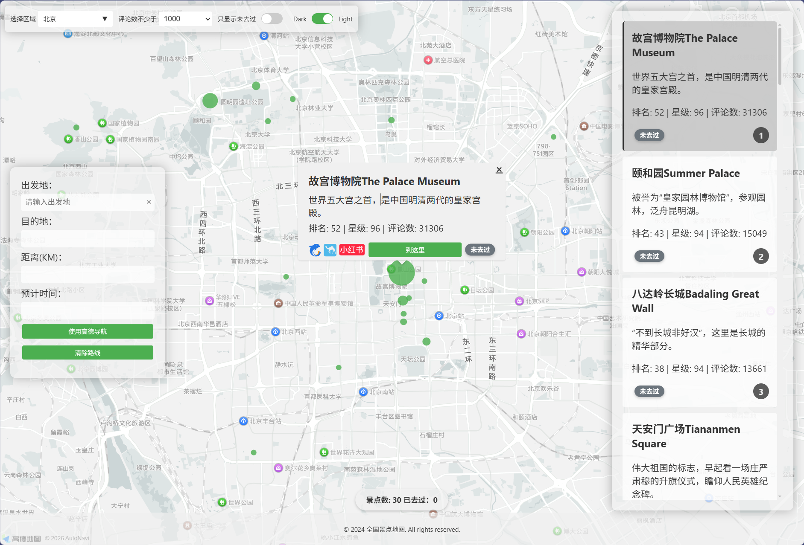
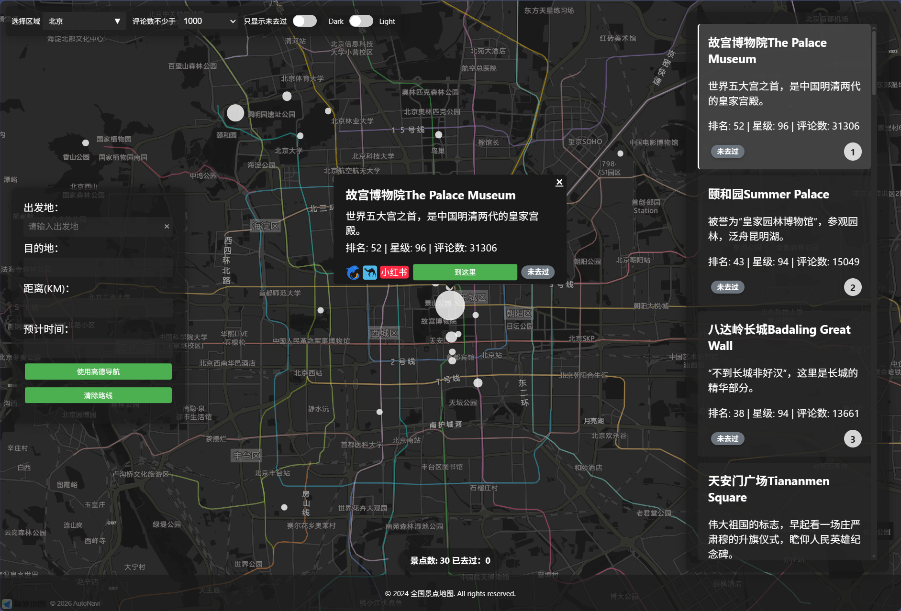

# 全国景点地图

一个基于高德地图的景点可视化应用，帮助用户探索中国各地的旅游景点。

## 预览

### 浅色主题


### 深色主题


## 功能特性

### 交互式地图
- 集成高德地图 API
- 景点标记大小根据评论数动态调整
- 点击标记查看景点详情

### 筛选功能
- 按省份筛选景点
- 按最少评论数筛选
- 仅显示未访问过的景点

### 主题切换
- 支持深色/浅色主题
- 主题偏好自动保存

### 景点信息
- 显示景点排名、星级、评论数
- 提供携程、去哪儿、小红书等平台链接

### 路线规划
- 支持设置出发地和目的地
- 显示路线距离和预计时间
- 可跳转至高德导航

### 响应式设计
- 适配桌面和移动端设备

## 快速开始

### 配置高德地图 Key

本项目使用高德地图 API，需要配置 Key 才能正常运行。

1. 访问 [高德开放平台](https://console.amap.com/)
2. 注册/登录账号
3. 进入「应用管理」→「创建应用」
4. 添加 Key（选择「Web端(JS API)」）
5. 在应用详情页开启「安全密钥」
6. 编辑 `js/config.local.js` 文件，填入你的配置：

```javascript
export const AMAP_KEY = '你的高德地图 Key';
export const AMAP_SECURITY_CONFIG = {
  securityJsCode: '你的安全密钥',
};
```

**注意**：`config.local.js` 文件已被添加到 `.gitignore`，不会被提交到 Git 仓库，避免 Key 泄露。

### 本地运行

由于浏览器安全限制，需要通过本地服务器访问：

```bash
# 使用 Python
python -m http.server 8080

# 或使用 Node.js
npx serve .
```

然后访问 `http://localhost:8080`

## 技术栈

- HTML5, CSS3, JavaScript (ES6+)
- 高德地图 JS API 2.0
- Font Awesome 图标
- localStorage 本地存储

## 项目结构

```
spotmap/
├── index.html          # 主页面
├── css/                # 样式文件
├── js/                 # JavaScript 模块
│   ├── config.js       # 配置文件（地图 Key 等）
│   ├── index.js        # 入口文件
│   ├── state.js        # 全局状态管理
│   ├── multiselect.js  # 多选下拉组件
│   ├── data/           # 数据相关
│   │   ├── spots.js    # 景点数据处理
│   │   └── storage.js  # localStorage 操作
│   ├── map/            # 地图相关
│   │   ├── init.js     # 地图初始化
│   │   ├── markers.js  # 标记管理
│   │   ├── infoWindow.js # 信息窗口
│   │   └── route.js    # 路线规划
│   ├── ui/             # UI 相关
│   │   ├── display.js  # 显示逻辑
│   │   ├── events.js   # 事件处理
│   │   └── theme.js    # 主题切换
│   └── utils/          # 工具函数
│       └── helpers.js  # 辅助函数
├── data/               # 景点数据
│   └── spots.json      # 景点数据文件
├── images/             # 图标图片
└── ReadMe.md           # 项目说明
```

## 注意事项

- 请勿将高德地图 Key 提交到公共仓库
- 建议在高德开放平台设置域名白名单
- 首次使用需配置 `js/config.js` 中的地图 Key

## 数据来源

景点数据存储在 `data/spots.json`，包含景点名称、坐标、评分、评论数等信息。
